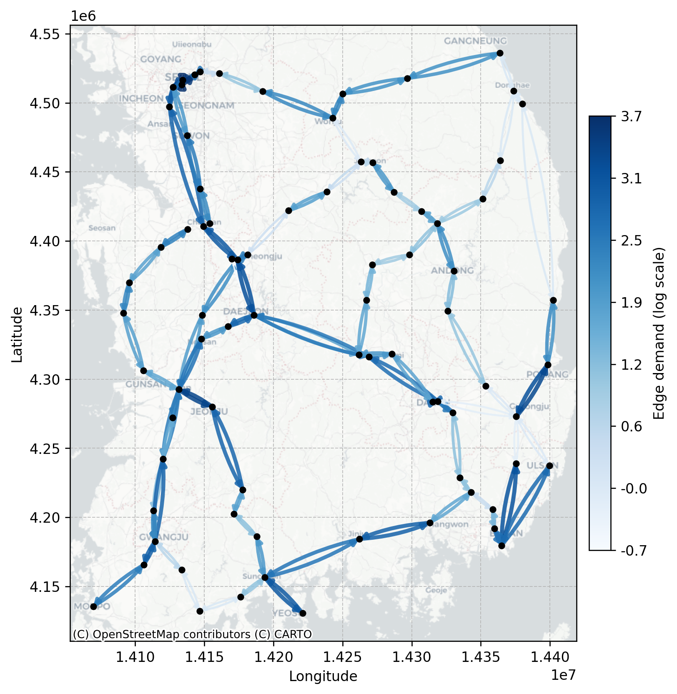
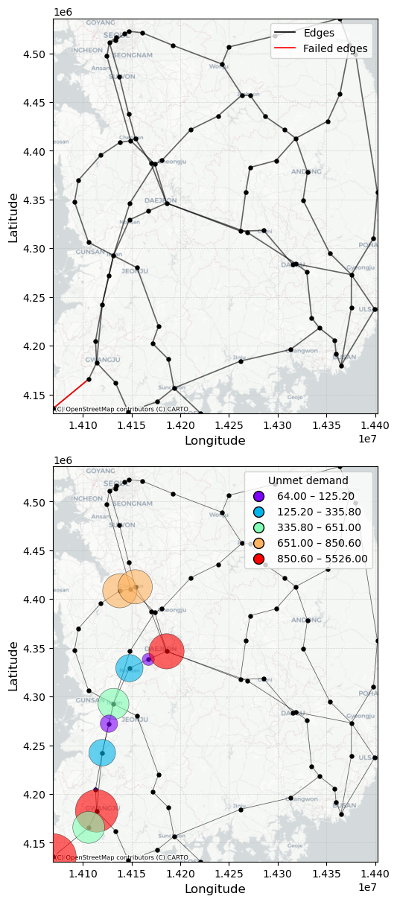
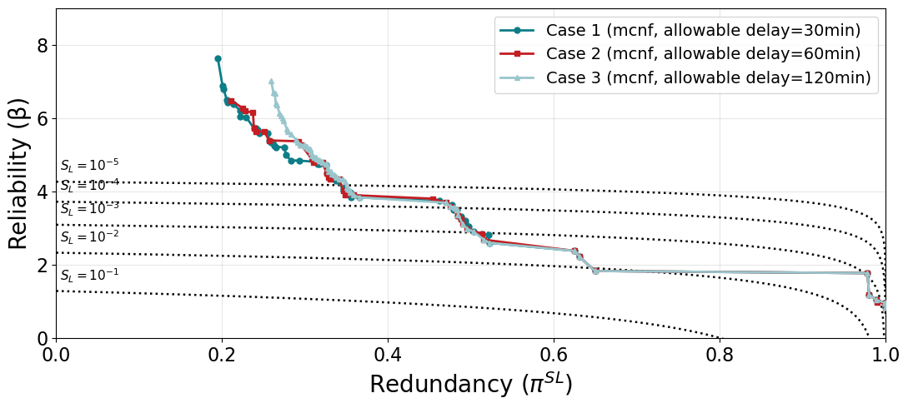

# Resilience Assessment and Decision Support for Complex Rail Networks

An optimization framework for enhancing railway resilience through **critical scenario analysis** and **dynamic train rescheduling**.

When a railway line is disrupted, two questions follow straight away:

1. **Which disruptions matter most?** A railway network has many ways to fail. Some are likely but harmless, and others are rare but damaging. We need a systematic way to find the scenarios that are *both* plausible *and* severe.
2. **How should trains be operated when a disruption happens?** Once a line is blocked, operators must decide which trains to hold, reroute, short-turn or cancel so that passengers suffer as little as possible.

This repository answers both questions with a two-stage workflow built on network-flow optimization:

| Stage | Folder | Question it answers | Core method |
|---|---|---|---|
| 1 | `02_critical_scenario_prioritization/` | Which combinations of failed track sections are most critical? | Multi-objective genetic algorithm (NSGA-II) + multi-commodity network flow (MCNF) |
| 2 | `03_rail_scheduling_dynamic_opt/` | Given a disruption, how should each train be rescheduled? | Time-expanded mixed-integer programming (MIP) |

Both stages measure passenger impact in the same way: **passenger demand × travel distance**. The loss counts demand that cannot be served at all, and adds a penalty for demand that arrives late. That penalty follows a delay-refund scheme, so a longer delay costs more.

The framework is applied to three networks:

- **toynet**: a 5-node toy network for testing
- **Korea**: the Korean intercity rail network (79 stations, 192 directed links, 105 train services)
- **UK**: the Great Britain rail network (61 stations, 214 directed links), including a **real-timetable variant** (`uk_real`) with separate data for each day of the week

<p align="center">
  
  &nbsp;
  
</p>
<p align="center"><em>Left: passenger demand on the Korean network (log scale). Right: a failed link (red) and the unmet demand it causes at each station.</em></p>

## What this toolkit invites innovation in

1. **Stress-testing rail networks**: find the "weakest links" of a network before they fail, and rank them by likelihood and consequence together.
2. **Comparing system models**: see how a simple connectivity check (shortest path) and a capacity-aware model (MCNF) disagree about which scenarios are critical.
3. **Disruption management**: test operating strategies such as rerouting, short-turning and cancellation on real timetables.
4. **Beyond**: other networks (metro, freight, road) can be plugged in by preparing the same JSON inputs. New ideas and extensions are warmly welcome.

## Research project

This repository was developed as part of the master's research of **Minji Kang** at Seoul National University. The research was supervised by [Prof. Junho Song](https://systemreliability.wordpress.com/junhosong/) (Seoul National University) and co-supervised by [Dr Ji-Eun Byun](https://profiles.imperial.ac.uk/j.byun) (Imperial College London).

---

## Requirements

- Python **3.10+**
- A **Gurobi** installation with a valid license. Both stages solve their optimization models with Gurobi (`gurobipy`). Free academic licenses are available from [gurobi.com](https://www.gurobi.com/academia/academic-program-and-licenses/).
  > Without a full license, only very small models (such as `toynet`) can be solved with the size-limited pip version of `gurobipy`.

Python packages:

| Purpose | Packages |
|---|---|
| Core | `numpy`, `scipy`, `pandas`, `networkx` |
| Optimization | `gurobipy`, `deap` |
| Progress bar | `tqdm` |
| Plotting and maps | `matplotlib`, `geopandas`, `shapely`, `contextily` |
| Testing | `pytest` |

```bash
git clone https://github.com/mjkang920/railnet_opt.git
cd railnet_opt
pip install numpy scipy pandas networkx gurobipy deap tqdm matplotlib geopandas shapely contextily pytest jupyter
```

---

## Data setup

All input data is **already included** in `01_data/`, so nothing needs to be downloaded. This section explains what each file contains so you can read the results, or prepare your own network in the same format.

### Common conventions

- **Nodes** are stations, named `n1`, `n2`, ….
- **Edges** are *directed* track sections, named `e1`, `e2`, …. The opposite direction of the same physical track gets the suffix `r` (for example, `e12` and `e12r`). In Stage 1, a "component" is the physical track, so failing `e12` also fails `e12r`.
- Coordinates are longitude/latitude (`x`, `y`) for Korea and the UK, and arbitrary plotting coordinates for `toynet`.

### File reference

| File | Used in | Content |
|---|---|---|
| `nodes.json` | Stage 1, 2 | `{"n1": {"x": lon, "y": lat}, ...}` |
| `edges.json` | Stage 1, 2 | For each directed edge: `from`, `to`, `tau` (travel time in time steps), `arc_distance` (m), `intact_capacity` (passengers), `probs` (`"0"` = failure probability, `"1"` = survival probability) |
| `demand_02.json` | Stage 1 | List of origin–destination (OD) pairs: `origin_name`, `destination_name`, `journeys` (passenger volume), `distance` (planned travel distance, m) |
| `routes_nodes.json` | Stage 2 | Station sequence of each train: `{"T1": ["n1", "n2", "n5"], ...}` |
| `dep_time.json` | Stage 2 | Departure time step of each train from its first station |
| `demand_03.json` | Stage 2 | Passengers on each train: `{"T1": [["n1", "n2", 194.67], ...]}` → (boarding station, alighting station, passengers) |
| `nodes_capacity.json` | Stage 2 *(optional)* | Maximum number of departures per time step at each station. If the file is missing, one constant (`CAPACITY_NODE`) is used for all stations. |
| `qgis_export*.xlsx`, `*.png` | — | Raw GIS export used to build the JSON files, and maps of capacity and demand |

A minimal example from `01_data/toynet/`:

```jsonc
// edges.json
"e1": { "from": "n1", "to": "n2", "tau": 2, "arc_distance": 50.0,
        "intact_capacity": 80.0, "probs": { "0": 0.2, "1": 0.8 } }

// routes_nodes.json             // dep_time.json
"T1": ["n1", "n2", "n5"]         "T1": 0
```

### Choosing a network

Each stage has an `inputs.py` that maps a region name to its files:

```python
# Stage 1
from inputs import input_files_kor, input_files_uk

# Stage 2
from inputs import get_input_files
fp = get_input_files("toynet")          # "toynet", "kor", "uk"
fp = get_input_files("uk_real", "MON")  # real GB timetable; day is required: MON … SUN
```

---

## Stage 1: Critical scenario prioritization

📁 `02_critical_scenario_prioritization/`

### Idea

Every failure scenario (a set of failed track sections) is scored on two axes:

- **Redundancy π**: the share of passenger-distance demand that the damaged network *can still serve*. Lower means more severe.
  `π = (total demand − expected loss) / total demand`
- **Reliability index β**: how *unlikely* the scenario is, `β = −Φ⁻¹(P_f)`, where `P_f` is the joint failure probability of the failed components. Lower β means a more likely scenario.

The critical scenarios are those with **low π and low β**, meaning they are both damaging and plausible. A multi-objective genetic algorithm (**NSGA-II**, via `deap`) searches the huge space of failure combinations and returns the **Pareto front** of these scenarios.

### How the loss of a scenario is computed (system functions)

`module.py` provides two "system functions" to compare:

| Function | Model | What it captures |
|---|---|---|
| `shortestpath_systemfunc` | Connectivity only | An OD pair is lost only if no path exists at all. |
| `MCNF_systemfunc` | Multi-commodity network flow (Gurobi LP with SOS2) | Rerouted passengers **compete for limited track capacity**. Detours longer than an **allowable delay** are not accepted, and delayed passengers incur a refund-style penalty. |

In the MCNF model, the delay penalty is a piecewise-linear refund ratio:

| Delay (min) | 0 | 15 | 30 | 60 | 120 |
|---|---|---|---|---|---|
| Refund ratio γ | 0 | 0.25 | 0.50 | 0.75 | 1.00 |

The detour distance is converted to delay minutes with an average train speed (`avg_velo`, default 149 km/h).

### How to run

1. Open `02_critical_scenario_prioritization/main.ipynb`. Run it **from inside this folder**, because it imports `inputs` and `module` from the current directory.
2. Choose the network:
   ```python
   REGION = "uk"   # or "kor"
   ```
3. Set the GA cases and parameters:
   ```python
   CASES = {1: dict(delay=30), 2: dict(delay=60), 3: dict(delay=120)}  # allowable delay (min)
   POP_SIZE = 350        # population size
   NGEN = 200            # max generations
   CXPB = 0.7            # crossover probability
   PROCESSES = 8         # parallel workers (set to your CPU core count)
   MAX_STAGNANT = 20     # early stop if the Pareto front is unchanged for 20 generations
   ```
4. Run all cells. The initial population is sampled with Latin Hypercube Sampling (1–10 failed components per scenario). Each scenario is evaluated in parallel, and repeated scenarios are cached.
   > ⏱ Each MCNF evaluation solves an LP, so a full run on the Korea/UK networks can take several hours. Reduce `POP_SIZE`/`NGEN` for a quick trial.

### Outputs

Results are saved in `outputs/<region>/Genetic_Algorithm/`:

- `GA_delay{30,60,120}_mcnf.json`, `GA_shortest.json`: the population and Pareto front of every generation. Each individual is stored as `{"pi": ..., "beta": ..., "failed": [component indices]}`.
- `GA*.png`: Pareto fronts plotted in the (π, β) plane.

<p align="center">
  
</p>

**How to read this plot:** each curve is a Pareto front, and points toward the lower left are more critical. The dotted lines are **resilience thresholds** for different acceptable risk levels `S_L = 10⁻¹ … 10⁻⁵`. A scenario falls *below* a line when `P_f × (1 − π) > S_L`, meaning it exceeds that risk tolerance.

### Inspecting critical scenarios: `visualization.ipynb`

1. **Critical scenarios in the failure zone**: for each allowable delay and each `S_L`, lists the Pareto scenarios below the threshold together with their failed components.
2. **Scenario simulation**: re-solves the MCNF for a chosen failure set and maps the **unmet demand at each station** as a bubble chart.

---

## Stage 2: Dynamic rail rescheduling

📁 `03_rail_scheduling_dynamic_opt/`

### Idea

Stage 1 tells us *which* disruptions are critical. Stage 2 asks *what to do* when one of them happens. The timetable is modeled as a **time-expanded network**: every station is copied at every time step, and each train is a flow moving through it. A mixed-integer program (Gurobi) then decides, for every train, which arcs to use.

- **Travel arcs**: move between stations (takes `tau` time steps).
- **Wait arcs**: stay at a station (hold the train, up to `max_wait` steps).
- **Dummy arcs**: terminate the train early (short-turn) at an allowed station.

The failed edges are **blocked** from the incident time `FAIL_T` until the line is cleared at `T_clear`. A train already on a failed section at `FAIL_T` keeps occupying its capacity.

### Decisions and objective

Trains are split into **affected trains** (their planned route uses a failed edge) and **unaffected trains**:

| Train group | What the model may decide |
|---|---|
| Affected (`T_aff`) | run or cancel (`h`), reroute onto other edges (small penalty), skip stops or serve only part of the OD pairs (`z`), terminate early after the incident location |
| Unaffected (`T_ok`) | stay on the planned route, but may be delayed by capacity conflicts |

The objective minimizes the total **passenger-distance-weighted loss**:

```
  cancelled trains      Σ q·d × (1 − h)
+ skipped OD pairs      Σ q·d × (1 − z)
+ delay refund penalty  Σ q·d × γ(delay)      (piecewise SOS2, same idea as Stage 1)
+ rerouting penalty
```

subject to flow conservation, dwell time, **edge capacity per time step** (`CAPACITY_EDGE`), **station departure capacity** (`CAPACITY_NODE` or `nodes_capacity.json`), and a running-time limit for each train.

### How to run

1. Open `03_rail_scheduling_dynamic_opt/main.ipynb`, again **from inside this folder**.
2. Set the scenario in the *Load data* cell:
   ```python
   REGION = "kor"            # "toynet", "kor", "uk", "uk_real"
   DAY    = "MON"            # only for REGION = "uk_real"

   T             = 96        # planning horizon (time steps)
   max_wait      = 4         # max holding time at a station
   CAPACITY_EDGE = 3         # trains per edge per time step
   CAPACITY_NODE = 2         # departures per station per time step (default)

   failed_edges = {"e91", "e91r", "e101", "e101r"}   # set() = normal operation
   FAIL_T  = 0               # time the incident starts
   T_clear = 6               # time the line reopens
   ```
   > 💡 A good choice for `failed_edges` is a critical scenario found in Stage 1. Include both directions (`eX` and `eXr`) to close a double-track section completely.
3. Run all cells. The notebook builds the time-expanded network (`build_arc_list_window`), builds and solves the MIP (`build_model_window`), and extracts each train's actual path.
   > If the model is infeasible, the notebook computes an IIS and writes `iis_win*.ilp` to help find the conflicting constraints.

### Outputs

- **Time–space diagrams** (`plot_all_lines_global`, `plot_lines_dynamic_y`, `plot_selected_lines`): planned and rescheduled train paths for each line, with the incident period highlighted.
- `opt_results_timetable_set().xlsx`: the optimized timetable (arrival and departure time of each train at each station).
- `rail_delay_only_leaflet.html`: an interactive map of total delay, which opens in any web browser.
- `visualization.ipynb`: demand flow maps such as `01_data/<region>/demand_map_03.png`.

---

## Quick start with the toy network

To check that everything works before running the large networks:

1. Run the tests (they use `01_data/toynet/`):
   ```bash
   pytest -v
   ```
2. In `03_rail_scheduling_dynamic_opt/main.ipynb`, set `REGION = "toynet"`, `failed_edges = {"e1"}` and run all cells. With three trains on five stations, the model solves in seconds, and you can see how train `T1` is rerouted or held.

## Testing

Unit tests in `tests/test_02_module.py` check the Stage 1 system functions on `toynet`:

- `shortestpath_systemfunc` and `MCNF_systemfunc` return the expected loss for given failure sets.
- `safe_pi` handles edge cases (zero demand, no loss, numerical tolerance).

```bash
pytest                              # run all tests
pytest -v                           # show each test
pytest tests/test_02_module.py      # run one file
```

VS Code users: the workspace is already set up for pytest (`.vscode/settings.json`). Open the **Testing** panel (beaker icon) to run the tests from the sidebar.
